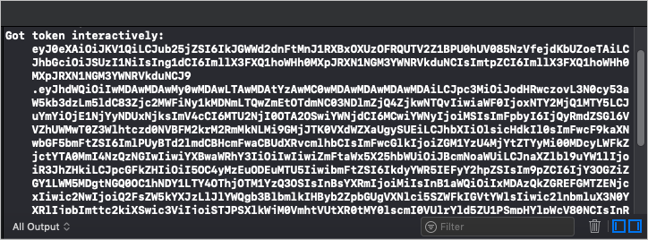

<!-- markdownlint-disable MD002 MD041 -->

En este ejercicio, ampliará la aplicación del ejercicio anterior para admitir la autenticación con Azure AD. Esto es necesario para obtener el token de acceso de OAuth necesario para llamar a Microsoft Graph. Para ello, integrará la [biblioteca de autenticación de Microsoft (MSAL) para iOS](https://github.com/AzureAD/microsoft-authentication-library-for-objc) en la aplicación.

1. Cree un nuevo archivo de **lista de propiedades** en el proyecto **GraphTutorial** denominado **AuthSettings. plist**.
1. Agregue los siguientes elementos al archivo en el diccionario **raíz** .

    | Key  | Tipo | Valor |
    |-----|------|-------|
    | `AppId` | Cadena | El identificador de la aplicación del portal de Azure |
    | `GraphScopes` | Matriz | Dos valores de cadena `User.Read` : y`Calendars.Read` |

    

> [!IMPORTANT]
> Si usa un control de código fuente como GIT, ahora sería un buen momento para excluir el archivo **AuthSettings. plist** del control de código fuente para evitar la pérdida inadvertida del identificador de la aplicación.

## <a name="implement-sign-in"></a>Implementar el inicio de sesión

En esta sección, configurará el proyecto para MSAL, creará una clase de administrador de autenticación y actualizará la aplicación para iniciar y cerrar sesión.

### <a name="configure-project-for-msal"></a>Configurar Project para MSAL

1. Agregue un nuevo grupo de llaves a las capacidades del proyecto.
    1. Seleccione el proyecto **GraphTutorial** y, a continuación, **firme funciones de &**.
    1. Seleccione **+ capacidad**y, a continuación, haga doble clic en **uso compartido de llaves**.
    1. Agregue un grupo de llaves con el `com.microsoft.adalcache`valor.

1. Control haga clic en **info. plist** y seleccione **Abrir como**y, a continuación, **código fuente**.
1. Agregue lo siguiente dentro del `<dict>` elemento.

    ```xml
    <key>CFBundleURLTypes</key>
    <array>
      <dict>
        <key>CFBundleURLSchemes</key>
        <array>
          <string>msauth.$(PRODUCT_BUNDLE_IDENTIFIER)</string>
        </array>
      </dict>
    </array>
    <key>LSApplicationQueriesSchemes</key>
    <array>
        <string>msauthv2</string>
        <string>msauthv3</string>
    </array>
    ```

1. Abra **AppDelegate. m** y agregue la siguiente instrucción Import en la parte superior del archivo.

    ```objc
    #import <MSAL/MSAL.h>
    ```

1. Agregue la siguiente función a la clase `AppDelegate`.

    :::code language="objc" source="../demo/GraphTutorial/GraphTutorial/AppDelegate.m" id="HandleMsalResponseSnippet":::

### <a name="create-authentication-manager"></a>Crear el administrador de autenticación

1. Cree una nueva **clase táctil de cacao** en el proyecto **GraphTutorial** denominado **AuthenticationManager**. Elija **NSObject** en el campo **subclase de** .
1. Abra **AuthenticationManager. h** y reemplace el contenido por el código siguiente.

    :::code language="objc" source="../demo/GraphTutorial/GraphTutorial/AuthenticationManager.h" id="AuthManagerSnippet":::

1. Abra **AuthenticationManager. m** y reemplace el contenido por el código siguiente.

    :::code language="objc" source="../demo/GraphTutorial/GraphTutorial/AuthenticationManager.m" id="AuthManagerSnippet":::

### <a name="add-sign-in-and-sign-out"></a>Agregar Inicio y cierre de sesión

1. Abra el archivo **SignInViewController. m** y reemplace su contenido por el código siguiente.

    :::code language="objc" source="../demo/GraphTutorial/GraphTutorial/SignInViewController.m" id="SignInViewSnippet":::

1. Abra **WelcomeViewController. m** y agregue la siguiente `import` instrucción a la parte superior del archivo.

    ```objc
    #import "AuthenticationManager.h"
    ```

1. Reemplace la función `signOut` existente por lo siguiente.

    :::code language="objc" source="../demo/GraphTutorial/GraphTutorial/WelcomeViewController.m" id="SignOutSnippet":::

1. Guarde los cambios y reinicie la aplicación en el simulador.

Si inicia sesión en la aplicación, debería ver un token de acceso que se muestra en la ventana de salida de Xcode.



## <a name="get-user-details"></a>Obtener detalles del usuario

En esta sección, creará una clase auxiliar que contendrá todas las llamadas a Microsoft Graph y actualizará el `WelcomeViewController` para que use esta nueva clase para obtener el usuario que ha iniciado sesión.

1. Cree una nueva **clase táctil de cacao** en el proyecto **GraphTutorial** denominado **GraphManager**. Elija **NSObject** en el campo **subclase de** .
1. Abra **GraphManager. h** y reemplace su contenido por el código siguiente.

    ```objc
    #import <Foundation/Foundation.h>
    #import <MSGraphClientSDK/MSGraphClientSDK.h>
    #import <MSGraphClientModels/MSGraphClientModels.h>
    #import <MSGraphClientModels/MSCollection.h>
    #import "AuthenticationManager.h"

    NS_ASSUME_NONNULL_BEGIN

    typedef void (^GetMeCompletionBlock)(MSGraphUser* _Nullable user, NSError* _Nullable error);

    @interface GraphManager : NSObject

    + (id) instance;
    - (void) getMeWithCompletionBlock: (GetMeCompletionBlock)completionBlock;

    @end

    NS_ASSUME_NONNULL_END
    ```

1. Abra **GraphManager. m** y reemplace su contenido por el código siguiente.

    ```objc
    #import "GraphManager.h"

    @interface GraphManager()

    @property MSHTTPClient* graphClient;

    @end

    @implementation GraphManager

    + (id) instance {
        static GraphManager *singleInstance = nil;
        static dispatch_once_t onceToken;
        dispatch_once(&onceToken, ^ {
            singleInstance = [[self alloc] init];
        });

        return singleInstance;
    }

    - (id) init {
        if (self = [super init]) {
            // Create the Graph client
            self.graphClient = [MSClientFactory
                                createHTTPClientWithAuthenticationProvider:AuthenticationManager.instance];
        }

        return self;
    }

    - (void) getMeWithCompletionBlock:(GetMeCompletionBlock)completionBlock {
        // GET /me
        NSString* meUrlString = [NSString stringWithFormat:@"%@/me", MSGraphBaseURL];
        NSURL* meUrl = [[NSURL alloc] initWithString:meUrlString];
        NSMutableURLRequest* meRequest = [[NSMutableURLRequest alloc] initWithURL:meUrl];

        MSURLSessionDataTask* meDataTask =
        [[MSURLSessionDataTask alloc]
            initWithRequest:meRequest
            client:self.graphClient
            completion:^(NSData *data, NSURLResponse *response, NSError *error) {
                if (error) {
                    completionBlock(nil, error);
                    return;
                }

                // Deserialize the response as a user
                NSError* graphError;
                MSGraphUser* user = [[MSGraphUser alloc] initWithData:data error:&graphError];

                if (graphError) {
                    completionBlock(nil, graphError);
                } else {
                    completionBlock(user, nil);
                }
            }];

        // Execute the request
        [meDataTask execute];
    }

    @end
    ```

1. Abra **WelcomeViewController. m** y agregue las siguientes `#import` instrucciones en la parte superior del archivo.

    ```objc
    #import "SpinnerViewController.h"
    #import "GraphManager.h"
    #import <MSGraphClientModels/MSGraphClientModels.h>
    ```

1. Agregue la siguiente propiedad a la `WelcomeViewController` declaración de interfaz.

    ```objc
    @property SpinnerViewController* spinner;
    ```

1. Reemplace el existente `viewDidLoad` por el código siguiente.

    :::code language="objc" source="../demo/GraphTutorial/GraphTutorial/WelcomeViewController.m" id="ViewDidLoadSnippet":::

Si guarda los cambios y reinicia la aplicación ahora, después de iniciar sesión, la interfaz de usuario se actualizará con el nombre para mostrar y la dirección de correo electrónico del usuario.
